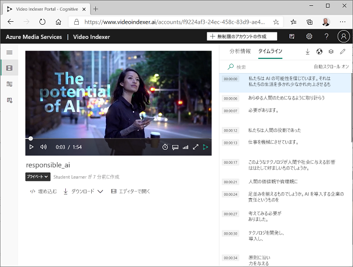
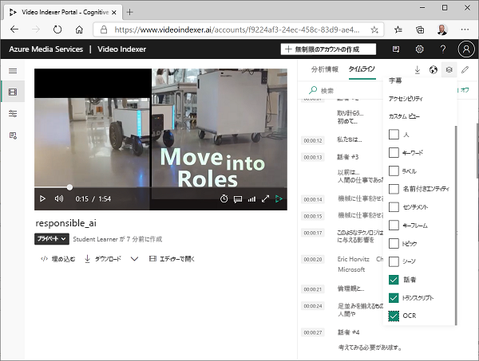

---
lab:
  title: Video Analyzer を使用する動画の分析
  module: Module 8 - Getting Started with Computer Vision
---

# Video Analyzer を使用する動画の分析

A large proportion of the data created and consumed today is in the format of video. <bpt id="p1">**</bpt>Video Analyzer for Media<ept id="p1">**</ept> is an AI-powered service that you can use to index videos and extract insights from them.

> <bpt id="p1">**</bpt>Note<ept id="p1">**</ept>: From June 21st 2022, capabilities of cognitive services that return personally identifiable information are restricted to customers who have been granted <bpt id="p2">[</bpt>limited access<ept id="p2">](https://docs.microsoft.com/azure/cognitive-services/cognitive-services-limited-access)</ept>. Without getting limited access approval, recognizing people and celebrities with Video Analyzer for this lab is not available. For more details about the changes Microsoft has made, and why - see <bpt id="p1">[</bpt>Responsible AI investments and safeguards for facial recognition<ept id="p1">](https://azure.microsoft.com/blog/responsible-ai-investments-and-safeguards-for-facial-recognition/)</ept>.

## このコースのリポジトリを複製する

**AI-102-AIEngineer** コード リポジトリをこのラボの作業をしている環境に既にクローンしている場合は、Visual Studio Code で開きます。それ以外の場合は、次の手順に従って今すぐクローンしてください。

1. Visual Studio Code を起動します。
2. パレットを開き (SHIFT+CTRL+P)、**Git:Clone** コマンドを実行して、`https://github.com/MicrosoftLearning/AI-102-AIEngineer` リポジトリをローカル フォルダーに複製します (どのフォルダーでも問題ありません)。
3. リポジトリを複製したら、Visual Studio Code でフォルダーを開きます。
4. リポジトリ内の C# コード プロジェクトをサポートするために追加のファイルがインストールされるまで待ちます。

    > **注**: ビルドとデバッグに必要なアセットを追加するように求めるダイアログが表示された場合は、 **[今はしない]** を選択します。

## 動画を Video Analyzer にアップロードする

最初に、Video Analyzer ポータルにサインインして、動画をアップロードする必要があります。

> <bpt id="p1">**</bpt>Tip<ept id="p1">**</ept>: If the Video Analyzer page is slow to load in the hosted lab environment, use your locally installed browser. You can switch back to the hosted VM for the later tasks.

1. ブラウザーで、Video Analyzer ポータル (`https://www.videoindexer.ai`) を開きます。
2. 今日作成および消費されているデータの大部分は動画形式です。
3. **Video Analyzer for Media** は、AI を利用したサービスであり、動画のインデックスを作成し、そこからインサイトを抽出するために使用できます。
4. ファイルがアップロードされたら、Video Analyzer が自動的にインデックスを作成するまで数分待ちます。

> **注**: この演習では、この動画を使用して Video Analyzer の機能を調べます。ただし、AI 対応アプリケーションを責任を持って開発するための有用な情報とガイダンスが含まれているため、演習が終了したら、時間をかけて完全に確認する必要があります。 

## ビデオ インサイトの確認

インデックス作成プロセスは、ポータルで表示できる動画からインサイトを抽出します。

1. In the Video Analyzer portal, when the video is indexed, select it to view it. You'll see the video player alongside a pane that shows insights extracted from the video.

![ビデオ プレーヤーと [インサイト] ペインを備えた Video Analyzer](./images/video-indexer-insights.png)

2. 動画の再生中に、**[タイムライン]** タブを選択して、動画オーディオのトランスクリプトを表示します。

3. ポータルの右上にある **[表示]** 記号 (&#128455; に似ています) を選択し、インサイトのリストで、**[トランスクリプト]** に加えて、**[OCR]** と **[スピーカー]** を選択します。

4. **[タイムライン]** ペインに次のものが含まれていることを確認します。
    - 音声ナレーションのトランスクリプト。
    - 動画に表示されるテキスト。
    - **注**:2022 年 6 月 21 日から、個人を特定できる情報を返すコグニティブ サービスの機能は、[制限付きアクセス](https://docs.microsoft.com/azure/cognitive-services/cognitive-services-limited-access)が許可されているお客様に限定されます。
5. 制限付きアクセスの承認を得ていない場合、このラボの Video Analyzer を使用して人や著名人を認識することはできません。
    - ビデオに表示される個々の人。
    - ビデオで議論されたトピック。
    - ビデオに表示されるオブジェクトのラベル。
    - ビデオに表示される人物やブランドなどの名前付きエンティティ。
    - キー シーン。
6. **[インサイト]** ペインが表示されている状態で、**[ビュー]** 記号を再度選択し、インサイトのリストで **[キーワード]** と **[感情]** をペインに追加します。

    Microsoft が行った変更と理由について詳しくは、「[顔認識に対する責任ある AI 投資と保護](https://azure.microsoft.com/blog/responsible-ai-investments-and-safeguards-for-facial-recognition/)」をご覧ください。

## インサイトを検索する

Video Analyzer を使用して、動画でインサイトを検索できます。

1. In the <bpt id="p1">**</bpt>Insights<ept id="p1">**</ept> pane, in the <bpt id="p2">**</bpt>Search<ept id="p2">**</ept> box, enter <bpt id="p3">*</bpt>Bee<ept id="p3">*</ept>. You may need to scroll down in the Insights pane to see results for all types of insight.
2. 下に示されている動画の場所で、一致する *ラベル* が 1 つ見つかったことを確認します。
3. ミツバチの存在が示されているセクションの先頭を選択し、その時点で動画を表示します (動画を一時停止して慎重に選択する必要がある場合があります。ミツバチは短時間しか表示されません。)
4. 動画のすべてのインサイトを表示するには、**[検索]** ボックスをクリアします。

## Video Analyzer ウィジェットを使用する

The Video Analyzer portal is a useful interface to manage video indexing projects. However, there may be occasions when you want to make the video and its insights available to people who don't have access to your Video Analyzer account. Video Analyzer provides widgets that you can embed in a web page for this purpose.

1. In Visual Studio Code, in the <bpt id="p1">**</bpt>16-video-indexer<ept id="p1">**</ept> folder, open <bpt id="p2">**</bpt>analyze-video.html<ept id="p2">**</ept>. This is a basic HTML page to which you will add the Video Analyzer <bpt id="p1">**</bpt>Player<ept id="p1">**</ept> and <bpt id="p2">**</bpt>Insights<ept id="p2">**</ept> widgets. Note the reference to the <bpt id="p1">**</bpt>vb.widgets.mediator.js<ept id="p1">**</ept> script in the header - this script enables multiple Video Analyzer widgets on the page to interact with one another.
2. Video Analyzer ポータルで、**[メディア ファイル]** ページに戻り、**責任ある AI** 動画を開きます。
3. ビデオ プレーヤーの下の **[&lt;/&gt; 埋め込み]** を選択し、HTML iframe コードを表示して、ウィジェットを埋め込みます。
4. **[共有と埋め込み]** ダイアログ ボックスで、**[プレーヤー]** ウィジェットを選択し、動画サイズを 560 x 315 に設定してから、埋め込みコードをクリップボードにコピーします。
5. Visual Studio Code の **analyze-video.html** ファイルで、コピーしたコードをコメント "**&lt;-- Player widget goes here -- &gt;**" の下に貼り付けます。
6. Back in the <bpt id="p1">**</bpt>Share and Embed<ept id="p1">**</ept> dialog box, select the <bpt id="p2">**</bpt>Insights<ept id="p2">**</ept> widget and then copy the embed code to the clipboard. Then close the <bpt id="p1">**</bpt>Share and Embed<ept id="p1">**</ept> dialog box, switch back to Visual Studio Code, and paste the copied code under the comment <bpt id="p2">**</bpt><ph id="ph1">&amp;lt;</ph>-- Insights widget goes here -- <ph id="ph2">&amp;gt;</ph><ept id="p2">**</ept>.
7. Save the file. Then in the <bpt id="p1">**</bpt>Explorer<ept id="p1">**</ept> pane, right-click <bpt id="p2">**</bpt>analyze-video.html<ept id="p2">**</ept> and select <bpt id="p3">**</bpt>Reveal in File Explorer<ept id="p3">**</ept>.
8. ブラウザーのファイル エクスプローラーで、**analyze-video.html** を開き、Web ページを表示します。
9. **[インサイト]** ウィジェットを使用してウィジェットを試して、「insights」を検索し、動画内でそれらにジャンプします。

## Video Analyzer REST API を使用する

Video Analyzer は、アカウントに動画をアップロードおよび管理するために使用できる REST API を提供します。

### API の詳細を取得する

Video Analyzer APIを使用するには、リクエストを認証するための情報が必要です。

1. Video Analyzer ポータルで、メニュー (≡) を展開し、**[アカウント設定]** ページを選択します。
2. このページの**アカウント ID** に注意してください。後で必要になります。
3. 新しいブラウザー タブを開き、Video Analyzer 開発者ポータル (`https://api-portal.videoindexer.ai`) に移動し、Video Analyzer アカウントの資格情報を使用してサインインします。
4. **[プロファイル]** ページで、プロファイルに関連付けられた**サブスクリプション**を表示します。
5. On the page with your subscription(s), observe that you have been assigned two keys (primary and secondary) for each subscription. Then select <bpt id="p1">**</bpt>Show<ept id="p1">**</ept> for any of the keys to see it. You will need this key shortly.

### REST API を使用する

Now that you have the account ID and an API key, you can use the REST API to work with videos in your account. In this procedure, you'll use a PowerShell script to make REST calls; but the same principles apply with HTTP utilities such as cURL or Postman, or any programming language capable of sending and receiving JSON over HTTP.

Video Analyzer REST API とのすべての対話は、同じパターンに従います。

- ヘッダーに API キーを含む **AccessToken** メソッドへの最初の要求は、アクセス トークンを取得するために使用されます。
- 後続のリクエストは、REST メソッドを呼び出して動画を操作するときに、アクセス トークンを使用して認証します。

1. Visual Studio Code の **16-video-indexer** フォルダーで、**get-videos.ps1** を開きます。
2. PowerShell スクリプトで、**YOUR_ACCOUNT_ID** および **YOUR_API_KEY** プレースホルダーを、以前に識別したアカウント ID および API キーの値に置き換えます。
3. Observe that the <bpt id="p1">*</bpt>location<ept id="p1">*</ept> for a free account is "trial". If you have created an unrestricted Video Analyzer account (with an associated Azure resource), you can change this to the location where your Azure resource is provisioned (for example "eastus").
4. スクリプトのコードを確認し、2 つの REST メソッドを呼び出すことに注意してください。1 つはアクセス トークンを取得するためのもので、もう 1 つはアカウント内の動画を一覧表示するためのものです。
5. 変更を保存してから、[スクリプト] ペインの右上で、**[&#9655;]** ボタンを使用して、スクリプトを実行します。
6. REST サービスからの JSON 応答を表示します。これには、以前にインデックスを作成した**責任のある AI** 動画の詳細が含まれているはずです。

## 詳細情報

Recognition of people and celebrities is still available, but following the <bpt id="p1">[</bpt>Responsible AI Standard<ept id="p1">](https://aka.ms/aah91ff)</ept> those are restricted behind a Limited Access policy. These features include facial identification and celebrity recognition. To learn more and apply for access, see the <bpt id="p1">[</bpt>Limited Access for Cognitive Services<ept id="p1">](https://docs.microsoft.com/en-us/azure/cognitive-services/cognitive-services-limited-access)</ept>.

**Video Analyzer** の詳細については、[Video Analyzer のドキュメント](https://docs.microsoft.com/azure/azure-video-analyzer/video-analyzer-for-media-docs/)を参照してください。
