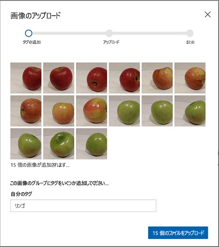
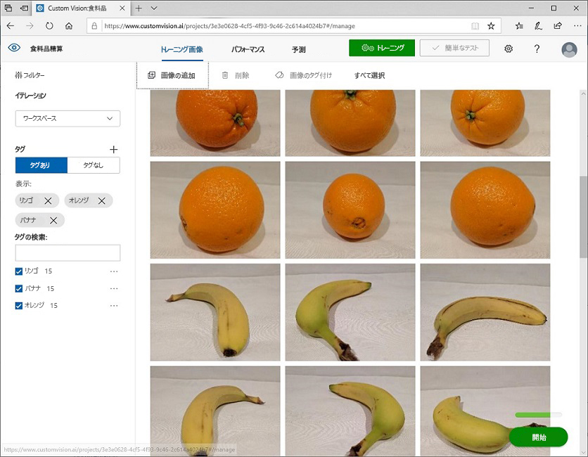

---
lab:
  title: Custom Vision を使用する画像の分類
  module: Module 9 - Developing Custom Vision Solutions
---

# <a name="classify-images-with-custom-vision"></a>Custom Vision を使用する画像の分類

The <bpt id="p1">**</bpt>Custom Vision<ept id="p1">**</ept> service enables you to create computer vision models that are trained on your own images. You can use it to train <bpt id="p1">*</bpt>image classification<ept id="p1">*</ept> and <bpt id="p2">*</bpt>object detection<ept id="p2">*</ept> models; which you can then publish and consume from applications.

この演習では、Computer Vision サービスを使用して、果物の 3 つのクラス (リンゴ、バナナ、オレンジ) を識別できる画像分類モデルをトレーニングします。

## <a name="clone-the-repository-for-this-course"></a>このコースのリポジトリを複製する

If you have not already cloned <bpt id="p1">**</bpt>AI-102-AIEngineer<ept id="p1">**</ept> code repository to the environment where you're working on this lab, follow these steps to do so. Otherwise, open the cloned folder in Visual Studio Code.

1. Visual Studio Code を起動します。
2. パレットを開き (SHIFT+CTRL+P)、**Git:Clone** コマンドを実行して、`https://github.com/MicrosoftLearning/AI-102-AIEngineer` リポジトリをローカル フォルダーに複製します (どのフォルダーでも問題ありません)。
3. リポジトリを複製したら、Visual Studio Code でフォルダーを開きます。
4. リポジトリ内の C# コード プロジェクトをサポートするために追加のファイルがインストールされるまで待ちます。

    > **注**: ビルドとデバッグに必要なアセットを追加するように求めるダイアログが表示された場合は、 **[今はしない]** を選択します。

## <a name="create-custom-vision-resources"></a>Custom Vision リソースを作成する

Before you can train a model, you will need Azure resources for <bpt id="p1">*</bpt>training<ept id="p1">*</ept> and <bpt id="p2">*</bpt>prediction<ept id="p2">*</ept>. You can create <bpt id="p1">**</bpt>Custom Vision<ept id="p1">**</ept> resources for each of these tasks, or you can create a single <bpt id="p2">**</bpt>Cognitive Services<ept id="p2">**</ept> resource and use it for either (or both).

この演習では、トレーニングと予測用の **Custom Vision** リソースを作成して、これらのワークロードのアクセスとコストを個別に管理できるようにします。

1. 新しいブラウザー タブで Azure portal (`https://portal.azure.com`) を開き、自分の Azure サブスクリプションに関連付けられている Microsoft アカウントを使用してサインインします。
2. **[&#65291;リソースの作成]** ボタンを選択し、*custom vision* を検索して、次の設定で **Custom Vision** リソースを作成します。
    - **作成オプション**: 両方
    - **[サブスクリプション]**:"*ご自身の Azure サブスクリプション*"
    - **リソース グループ**: *リソース グループを選択または作成します (制限付きサブスクリプションを使用している場合は、新しいリソース グループを作成する権限がないことがあります。提供されているものを使ってください)*
    - **[リージョン]**: 使用できるリージョンを選択します**
    - **[名前]**: *一意の名前を入力します*
    - **トレーニング価格レベル**: F0
    - **[予測価格レベル]**: F0

    > **注**: サブスクリプションに既に F0 Custom Vision サービスがある場合は、このサービスに **S0** を選択してください。

3. **Custom Vision** を使用すると、独自の画像でトレーニングされた Computer Vision モデルを作成できます。

> これを使用して、*画像分類* および *物体検出* モデルをトレーニングできます。その後、公開してアプリケーションから利用できます。

## <a name="create-a-custom-vision-project"></a>Custom Vision プロジェクトを作成する

To train an image classification model, you need to create a Custom Vision project based on your training resource. To do this, you'll use the Custom Vision portal.

1. In Visual Studio Code, view the training images in the <bpt id="p1">**</bpt>17-image-classification/training-images<ept id="p1">**</ept> folder where you cloned the repository. This folder contains subfolders of apple, banana, and orange images.
2. In a new browser tab, open the Custom Vision portal at <ph id="ph1">`https://customvision.ai`</ph>. If prompted, sign in using the Microsoft account associated with your Azure subscription and agree to the terms of service.
3. Custom Vision ポータルで、次の設定を使って新しいプロジェクトを作成します。
    - **名前**: フルーツの分類
    - **説明**: フルーツの画像分類
    - **リソース**: "以前に作成した Custom Vision リソース"**
    - **プロジェクトの種類**: 分類
    - **分類の種類**: マルチクラス (画像ごとに 1 つのタグ)
    - **ドメイン**: 食品
4. このラボで作業している環境に **AI-102-AIEngineer** コードのリポジトリをまだクローンしていない場合は、次の手順に従ってクローンします。


   
5. 前の手順を繰り返し、**banana** フォルダー内の画像には *banana* タグを、**orange** フォルダー内の画像には *orange* タグを付けてアップロードします。
6. Custom Vision プロジェクトでアップロードした画像を探します。次のように各クラスの画像が 15 個あるはずです。


    
7. それ以外の場合は、複製されたフォルダーを Visual Studio Code で開きます。
8. モデルの反復をトレーニングしたら、*Precision*、*Recall*、*AP* のパフォーマンス メトリックを確認します。これらは分類モデルの予測精度を測るものであり、すべて高くするようにします。

> <bpt id="p1">**</bpt>Note<ept id="p1">**</ept>: The performance metrics are based on a probability threshold of 50% for each prediction (in other words, if the model calculates a 50% or higher probability that an image is of a particular class, then that class is predicted). You can adjust this at the top-left of the page.

## <a name="test-the-model"></a>モデルのテスト

モデルをトレーニングしたので、テストできます。

1. パフォーマンス メトリックの上にある **[クイック テスト]** をクリックします。
2. **[画像の URL]** ボックスに「`https://aka.ms/apple-image`」と入力し、&#10132 をクリックします。
3. モデルによって返される予測を確認します。次のように *apple* の確率スコアが最も高くなるはずです。


4. その後、**[クイック テスト]** ウィンドウを閉じます。

## <a name="view-the-project-settings"></a>プロジェクト設定を表示する

作成したプロジェクトには一意の識別子が割り当てられており、それを操作するコードで指定する必要があります。

1. **[パフォーマンス]** ページの右上にある *設定* (&#9881;) アイコンをクリックして、プロジェクトの設定を表示します。
2. **[一般]** (左側) の下で、このプロジェクトを一意に識別する **[プロジェクト ID]** に注意してください。
3. On the right, under <bpt id="p1">**</bpt>Resources<ept id="p1">**</ept> note that the key and endpoint are shown. These are the details for the <bpt id="p1">*</bpt>training<ept id="p1">*</ept> resource (you can also obtain this information by viewing the resource in the Azure portal).

## <a name="use-the-training-api"></a>*トレーニング* API を使用する

The Custom Vision portal provides a convenient user interface that you can use to upload and tag images, and train models. However, in some scenarios you may want to automate model training by using the Custom Vision training API.

> <bpt id="p1">**</bpt>Note<ept id="p1">**</ept>: In this exercise, you can choose to use the API from either the <bpt id="p2">**</bpt>C#<ept id="p2">**</ept> or <bpt id="p3">**</bpt>Python<ept id="p3">**</ept> SDK. In the steps below, perform the actions appropriate for your preferred language.

1. Visual Studio Code の **[エクスプローラー]** ペインで、**17-image_classification** フォルダーを参照し、言語の設定に応じて **C-Sharp** または **Python** フォルダーを展開します。
2. Right-click the <bpt id="p1">**</bpt>train-classifier<ept id="p1">**</ept> folder and open an integrated terminal. Then install the Custom Vision Training package by running the appropriate command for your language preference:

**C#**

```
dotnet add package Microsoft.Azure.CognitiveServices.Vision.CustomVision.Training --version 2.0.0
```

**Python**

```
pip install azure-cognitiveservices-vision-customvision==3.1.0
```

3. **train-classifier** フォルダーの内容を表示し、構成設定用のファイルが含まれていることに注意してください。
    - **C#** : appsettings.json
    - **Python**: .env

    Open the configuration file and update the configuration values it contains to reflect the endpoint and key for your Custom Vision <bpt id="p1">*</bpt>training<ept id="p1">*</ept> resource, and the project ID for the classification project you created previously. Save your changes.
4. **train-classifier** フォルダーには、クライアント アプリケーションのコード ファイルが含まれていることに注意してください。

    - **C#** : Program.cs
    - **Python**: train-classifier.py

    コード ファイルを開き、含まれているコードを確認して、次の詳細に注意してください。
    - インストールしたパッケージの名前空間インポートされます
    - **Main** 関数は、構成設定を取得し、キーとエンドポイントを使用して認証済みの **CustomVisionTrainingClient** を作成します。これは、プロジェクト ID とともに使用され、プロジェクトへの**プロジェクト**参照を作成します。
    - **Upload_Images** 関数は、Custom Vision プロジェクトで定義されているタグを取得し、対応する名前のフォルダーからプロジェクトに画像ファイルをアップロードして、適切なタグ ID を割り当てます。
    - **Train_Model** 関数は、プロジェクトの新しいトレーニング反復を作成し、トレーニングが完了するのを待ちます。
5. **train-classifier** フォルダーの統合ターミナルに戻り、次のコマンドを入力してプログラムを実行します。

**C#**

```
dotnet run
```

**Python**

```
python train-classifier.py
```
    
6. Wait for the program to end. Then return to your browser and view the <bpt id="p1">**</bpt>Training Images<ept id="p1">**</ept> page for your project in the Custom Vision portal (refreshing the browser if necessary).
7. モデルをトレーニングする前に、*トレーニング* と *予測* のために Azure リソースが必要になります。

## <a name="publish-the-image-classification-model"></a>画像分類モデルを発行する

これで、トレーニング済みモデルを公開して、クライアント アプリケーションから使用できるようにする準備が整いました。

1. Custom Vision ポータルの **[パフォーマンス]** ページで、 **[&#128504; 公開]** をクリックして、トレーニング済みモデルを次の設定で公開します。
    - **モデル名**: fruit-classifier
    - **予測リソース**: *前に作成した "-Prediction" で終わる**予測**リソース (トレーニング リソースでは<u>ありません</u>)。*
2. **[プロジェクト設定]** ページの左上にある *[プロジェクトギャラリー]* (&#128065) アイコンをクリックして、プロジェクトが一覧表示されている Custom Vision ポータルの [ホーム] ページに戻ります。
3. これらのタスクごとに **Custom Vision** リソースを作成することも、単一の **Cognitive Services** リソースを作成していずれか (または両方) に使用することもできます。

## <a name="use-the-image-classifier-from-a-client-application"></a>クライアント アプリケーションからの画像分類子を使用する

Now that you've published the image classification model, you can use it from a client application. Once again, you can choose to use <bpt id="p1">**</bpt>C#<ept id="p1">**</ept> or <bpt id="p2">**</bpt>Python<ept id="p2">**</ept>.

1. In Visual Studio Code, in the <bpt id="p1">**</bpt>17-image-classification<ept id="p1">**</ept> folder, in the subfolder for your preferred language (<bpt id="p2">**</bpt>C-Sharp<ept id="p2">**</ept> or <bpt id="p3">**</bpt>Python<ept id="p3">**</ept>), right- the <bpt id="p4">**</bpt>test-classifier<ept id="p4">**</ept> folder and open an integrated terminal. Then enter the following SDK-specific command to install the Custom Vision Prediction package:

**C#**

```
dotnet add package Microsoft.Azure.CognitiveServices.Vision.CustomVision.Prediction --version 2.0.0
```

**Python**

```
pip install azure-cognitiveservices-vision-customvision==3.1.0
```

> **注**: Python SDK パッケージには、トレーニング パッケージと予測パッケージの両方が含まれており、既にインストールされている場合があります。

2. **test-classifier** フォルダーを展開して、そこに含まれるファイルを表示します。これらのファイルは、画像分類モデルのテスト クライアント アプリケーションを実装するために使用されます。
3. Open the configuration file for your client application (<bpt id="p1">*</bpt>appsettings.json<ept id="p1">*</ept> for C# or <bpt id="p2">*</bpt>.env<ept id="p2">*</ept> for Python) and update the configuration values it contains to reflect the endpoint and key for your Custom Vision <bpt id="p3">*</bpt>prediction<ept id="p3">*</ept> resource, the project ID for the classification project, and the name of your published model (which should be <bpt id="p4">*</bpt>fruit-classifier<ept id="p4">*</ept>). Save your changes.
4. クライアント アプリケーションのコード ファイル (C# の場合は *Program.cs*、Python の場合は *test-classification.py*) を開き、含まれているコードを確認して、次の詳細に注意してください。
    - インストールしたパッケージの名前空間インポートされます
    - **Main** 関数は構成設定を取得し、キーとエンドポイントを使用して認証済みの **CustomVisionPredictionClient** を作成します。
    - The prediction client object is used to predict a class for each image in the <bpt id="p1">**</bpt>test-images<ept id="p1">**</ept> folder, specifying the project ID and model name for each request. Each prediction includes a probability for each possible class, and only predicted tags with a probability greater than 50% are displayed.
5. **test-classifier** フォルダーの統合ターミナルに戻り、次のコマンドを入力してプログラムを実行します。

**C#**

```
dotnet run
```

**Python**

```
python test-classifier.py
```

6. View the label (tag) and probability scores for each prediction. You can view the images in the <bpt id="p1">**</bpt>test-images<ept id="p1">**</ept> folder to verify that the model has classified them correctly.

## <a name="more-information"></a>詳細情報

Custom Vision サービスを使用した画像分類の詳細については、[Custom Vision のドキュメント](https://docs.microsoft.com/azure/cognitive-services/custom-vision-service/)を参照してください。
