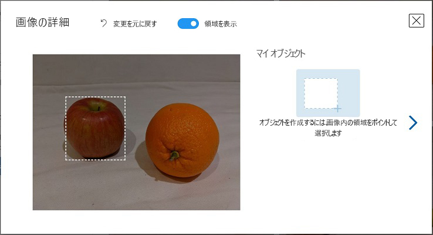
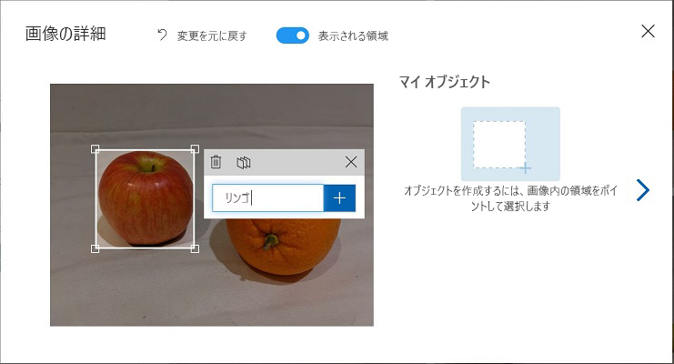

---
lab:
  title: Custom Vision 使用する画像内の物体の検出
  module: Module 9 - Developing Custom Vision Solutions
---

# <a name="detect-objects-in-images-with-custom-vision"></a>Custom Vision 使用する画像内の物体の検出

この演習では、Custom Vision サービスを使用して、画像内の 3 つのクラスの果物 (リンゴ、バナナ、オレンジ) を検出して特定できる *物体検出* モデルをトレーニングします。

## <a name="clone-the-repository-for-this-course"></a>このコースのリポジトリを複製する

**AI-102-AIEngineer** コード リポジトリをこのラボの作業をしている環境に既にクローンしている場合は、Visual Studio Code で開きます。それ以外の場合は、次の手順に従って今すぐクローンしてください。

1. Visual Studio Code を起動します。
2. パレットを開き (SHIFT+CTRL+P)、**Git:Clone** コマンドを実行して、`https://github.com/MicrosoftLearning/AI-102-AIEngineer` リポジトリをローカル フォルダーに複製します (どのフォルダーでも問題ありません)。
3. リポジトリを複製したら、Visual Studio Code でフォルダーを開きます。
4. リポジトリ内の C# コード プロジェクトをサポートするために追加のファイルがインストールされるまで待ちます。

    > **注**: ビルドとデバッグに必要なアセットを追加するように求めるダイアログが表示された場合は、 **[今はしない]** を選択します。

## <a name="create-custom-vision-resources"></a>Custom Vision リソースを作成する

If you already have <bpt id="p1">**</bpt>Custom Vision<ept id="p1">**</ept> resources for training and prediction in your Azure subscription, you can use them in this exercise. If not, use the following instructions to create them.

1. 新しいブラウザー タブで Azure portal (`https://portal.azure.com`) を開き、自分の Azure サブスクリプションに関連付けられている Microsoft アカウントを使用してサインインします。
2. **[&#65291;リソースの作成]** ボタンを選択し、*custom vision* を検索して、次の設定で **Custom Vision** リソースを作成します。
    - **作成オプション**: 両方
    - **[サブスクリプション]**:"*ご自身の Azure サブスクリプション*"
    - **リソース グループ**: *リソース グループを選択または作成します (制限付きサブスクリプションを使用している場合は、新しいリソース グループを作成する権限がないことがあります。提供されているものを使ってください)*
    - **[リージョン]**: 使用できるリージョンを選択します**
    - **[名前]**: *一意の名前を入力します*
    - **トレーニング価格レベル**: F0
    - **[予測価格レベル]**: F0

    > **注**: サブスクリプションに既に F0 Custom Vision サービスがある場合は、このサービスに **S0** を選択してください。

3. Wait for the resources to be created, and then view the deployment details and note that two Custom Vision resources are provisioned; one for training, and another for prediction (evident by the <bpt id="p1">**</bpt>-Prediction<ept id="p1">**</ept> suffix). You can view these by navigating to the resource group where you created them.

> <bpt id="p1">**</bpt>Important<ept id="p1">**</ept>: Each resource has its own <bpt id="p2">*</bpt>endpoint<ept id="p2">*</ept> and <bpt id="p3">*</bpt>keys<ept id="p3">*</ept>, which are used to manage access from your code. To train an image classification model, your code must use the <bpt id="p1">*</bpt>training<ept id="p1">*</ept> resource (with its endpoint and key); and to use the trained model to predict image classes, your code must use the <bpt id="p2">*</bpt>prediction<ept id="p2">*</ept> resource (with its endpoint and key).

## <a name="create-a-custom-vision-project"></a>Custom Vision プロジェクトを作成する

To train an object detection model, you need to create a Custom Vision project based on your training resource. To do this, you'll use the Custom Vision portal.

1. 新しいブラウザー タブで Custom Vision ポータル (`https://customvision.ai`) を開き、ご利用の Azure サブスクリプションに関連付けられている Microsoft アカウントを使用してサインインします。
2. 次の設定で新しいプロジェクトを作成します。
    - **名前**: 果物の検出
    - **説明**: 果物の物体検出。
    - **リソース**: "以前に作成した Custom Vision リソース"**
    - **プロジェクトの種類**: 物体検出
    - **ドメイン**: 全般
3. プロジェクトが作成され、ブラウザーで開かれるまで待ちます。

## <a name="add-and-tag-images"></a>画像を追加してタグを付ける

物体検出モデルをトレーニングするには、モデルで識別するクラスが含まれている画像をアップロードし、各物体インスタンスの境界ボックスを示すためにタグを付ける必要があります。

1. In Visual Studio Code, view the training images in the <bpt id="p1">**</bpt>18-object-detection/training-images<ept id="p1">**</ept> folder where you cloned the repository. This folder contains images of fruit.
2. Custom Vision ポータルの物体検出プロジェクトで、 **[画像の追加]** を選択し、抽出したフォルダーのすべての画像をアップロードします。
3. 画像がアップロードされた後、最初のものを選択して開きます。
4. Hold the mouse over any object in the image until an automatically detected region is displayed like the image below. Then select the object, and if necessary resize the region to surround it.



単に物体の周りをドラッグして領域を作成することもできます。

5. 領域で物体が囲まれたら、次に示すように、適切な物体の種類 (*apple*、*banana*、または *orange*) で新しいタグを追加します。



6. 画像内の互いの物体を選択してタグを付け、必要に応じて領域のサイズを変更し、新しいタグを追加します。


7. Use the <bpt id="p1">**</bpt><ph id="ph1">&gt;</ph><ept id="p1">**</ept> link on the right to go to the next image, and tag its objects. Then just keep working through the entire image collection, tagging each apple, banana, and orange.

8. 最後の画像のタグ付けが終了したら、**[Image Detail]\(画像の詳細\)** エディターを閉じ、**[画像のトレーニング]** ページの **[タグ]** で **[タグ付け]** を選択して、タグ付けされたすべての画像を表示します。


## <a name="use-the-training-api-to-upload-images"></a>Training API を使用して画像をアップロードする

You can use the graphical tool in the Custom Vision portal to tag your images, but many AI development teams use other tools that generate files containing information about tags and object regions in images. In scenarios like this, you can use the Custom Vision training API to upload tagged images to the project.

> <bpt id="p1">**</bpt>Note<ept id="p1">**</ept>: In this exercise, you can choose to use the API from either the <bpt id="p2">**</bpt>C#<ept id="p2">**</ept> or <bpt id="p3">**</bpt>Python<ept id="p3">**</ept> SDK. In the steps below, perform the actions appropriate for your preferred language.

1. Custom Vision ポータルの **[画像のトレーニング]** ページの右上にある *設定* (&#9881;) アイコンをクリックして、プロジェクトの設定を表示します。
2. **[一般]** (左側) の下で、このプロジェクトを一意に識別する **[プロジェクト ID]** に注意してください。
3. On the right, under <bpt id="p1">**</bpt>Resources<ept id="p1">**</ept> note that the key and endpoint are shown. These are the details for the <bpt id="p1">*</bpt>training<ept id="p1">*</ept> resource (you can also obtain this information by viewing the resource in the Azure portal).
4. Visual Studio Code の **18-object-detection** フォルダーの下で、言語の設定に応じて **C-Sharp** または **Python** フォルダーを展開します。
5. Right-click the <bpt id="p1">**</bpt>train-detector<ept id="p1">**</ept> folder and open an integrated terminal. Then install the Custom Vision Training package by running the appropriate command for your language preference:

**C#**

```
dotnet add package Microsoft.Azure.CognitiveServices.Vision.CustomVision.Training --version 2.0.0
```

**Python**

```
pip install azure-cognitiveservices-vision-customvision==3.1.0
```

6. **train-detector** フォルダーの内容を表示し、構成設定用のファイルが含まれていることに注意してください。
    - **C#** : appsettings.json
    - **Python**: .env

    Open the configuration file and update the configuration values it contains to reflect the endpoint and key for your Custom Vision <bpt id="p1">*</bpt>training<ept id="p1">*</ept> resource, and the project ID for the object detection project you created previously. Save your changes.

7. Azure サブスクリプションでトレーニングと予測のための **Custom Vision** リソースが既にある場合は、この演習でそれらを使用できます。

    > そうでない場合は、次の手順を使用して作成してください。

8. **train-detector** フォルダーには、JSON ファイルで参照されている画像ファイルが保存されているサブフォルダーが含まれていることに注意してください。


9. **train-detector** フォルダーには、クライアント アプリケーションのコード ファイルが含まれていることに注意してください

    - **C#** : Program.cs
    - **Python**: train-detector.py

    コード ファイルを開き、含まれているコードを確認して、次の詳細に注意してください。
    - インストールしたパッケージの名前空間インポートされます
    - **Main** 関数は、構成設定を取得し、キーとエンドポイントを使用して認証済みの **CustomVisionTrainingClient** を作成します。これは、プロジェクト ID とともに使用され、プロジェクトへの**プロジェクト**参照を作成します。
    - **Upload_Images** 関数は、JSON ファイルからタグ付けされた領域情報を抽出し、それを使用して領域を含む画像のバッチを作成し、それをプロジェクトにアップロードします。
10. **train-detector** フォルダーの統合ターミナルに戻り、次のコマンドを入力してプログラムを実行します。
    
**C#**

```
dotnet run
```

**Python**

```
python train-detector.py
```
    
11. Wait for the program to end. Then return to your browser and view the <bpt id="p1">**</bpt>Training Images<ept id="p1">**</ept> page for your project in the Custom Vision portal (refreshing the browser if necessary).
12. いくつかの新しいタグ付き画像がプロジェクトに追加されていることを確認します。

## <a name="train-and-test-a-model"></a>モデルをトレーニングしてテストする

これでプロジェクト内の画像にタグを付けたので、モデルをトレーニングする準備ができました。

1. In the Custom Vision project, click <bpt id="p1">**</bpt>Train<ept id="p1">**</ept> to train an object detection model using the tagged images. Select the <bpt id="p1">**</bpt>Quick Training<ept id="p1">**</ept> option.
2. トレーニングが完了するのを待ってから (10 分ほどかかる場合があります)、*正確性*、*再現性*、*mAP* などのパフォーマンス指標を確認します。これらは分類モデルの予測精度の指標であり、すべて高い値を示しているはずです。
3. At the top right of the page, click <bpt id="p1">**</bpt>Quick Test<ept id="p1">**</ept>, and then in the <bpt id="p2">**</bpt>Image URL<ept id="p2">**</ept> box, enter <ph id="ph1">`https://aka.ms/apple-orange`</ph> and view the prediction that is generated. Then close the <bpt id="p1">**</bpt>Quick Test<ept id="p1">**</ept> window.

## <a name="publish-the-object-detection-model"></a>物体検出モデルを公開する

これで、トレーニング済みモデルを公開して、クライアント アプリケーションから使用できるようにする準備が整いました。

1. Custom Vision ポータルの **[パフォーマンス]** ページで、 **[&#128504; 公開]** をクリックして、トレーニング済みモデルを次の設定で公開します。
    - **モデル名**: fruit-detector
    - **予測リソース**: *前に作成した "-Prediction" で終わる**予測**リソース (トレーニング リソースでは<u>ありません</u>)。*
2. **[プロジェクト設定]** ページの左上にある *[プロジェクトギャラリー]* (&#128065) アイコンをクリックして、プロジェクトが一覧表示されている Custom Vision ポータルの [ホーム] ページに戻ります。
3. On the Custom Vision portal home page, at the top right, click the <bpt id="p1">*</bpt>settings<ept id="p1">*</ept> (&amp;#9881;) icon to view the settings for your Custom Vision service. Then, under <bpt id="p1">**</bpt>Resources<ept id="p1">**</ept>, find your <bpt id="p2">*</bpt>prediction<ept id="p2">*</ept> resource which ends with "-Prediction" (<bpt id="p3">&lt;u&gt;</bpt>not<ept id="p3">&lt;/u&gt;</ept> the training resource) to determine its <bpt id="p4">**</bpt>Key<ept id="p4">**</ept> and <bpt id="p5">**</bpt>Endpoint<ept id="p5">**</ept> values (you can also obtain this information by viewing the resource in the Azure portal).

## <a name="use-the-image-classifier-from-a-client-application"></a>クライアント アプリケーションからの画像分類子を使用する

Now that you've published the image classification model, you can use it from a client application. Once again, you can choose to use <bpt id="p1">**</bpt>C#<ept id="p1">**</ept> or <bpt id="p2">**</bpt>Python<ept id="p2">**</ept>.

1. Visual Studio Code で、**18-object-detection** フォルダーを参照し、使用する言語のフォルダー (**C-Sharp** または **Python**) で、**test-detector** フォルダーを展開します。
2. Right-click the <bpt id="p1">**</bpt>test-detector<ept id="p1">**</ept> folder and open an integrated terminal. Then enter the following SDK-specific command to install the Custom Vision Prediction package:

**C#**

```
dotnet add package Microsoft.Azure.CognitiveServices.Vision.CustomVision.Prediction --version 2.0.0
```

**Python**

```
pip install azure-cognitiveservices-vision-customvision==3.1.0
```

> **注**: Python SDK パッケージには、トレーニング パッケージと予測パッケージの両方が含まれており、既にインストールされている場合があります。

3. Open the configuration file for your client application (<bpt id="p1">*</bpt>appsettings.json<ept id="p1">*</ept> for C# or <bpt id="p2">*</bpt>.env<ept id="p2">*</ept> for Python) and update the configuration values it contains to reflect the endpoint and key for your Custom Vision <bpt id="p3">*</bpt>prediction<ept id="p3">*</ept> resource, the project ID for the object detection project, and the name of your published model (which should be <bpt id="p4">*</bpt>fruit-detector<ept id="p4">*</ept>). Save your changes.
4. クライアント アプリケーションのコード ファイル (C# の場合は *Program.cs*、Python の場合は *test-detector.py*) を開き、含まれているコードを確認して、次の詳細に注意してください。
    - インストールしたパッケージの名前空間インポートされます
    - **Main** 関数は構成設定を取得し、キーとエンドポイントを使用して認証済みの **CustomVisionPredictionClient** を作成します。
    - The prediction client object is used to get object detection predictions for the <bpt id="p1">**</bpt>produce.jpg<ept id="p1">**</ept> image, specifying the project ID and model name in the request. The predicted tagged regions are then drawn on the image, and the result is saved as <bpt id="p1">**</bpt>output.jpg<ept id="p1">**</ept>.
5. **test-detector** フォルダーの統合ターミナルに戻り、次のコマンドを入力してプログラムを実行します。

**C#**

```
dotnet run
```

**Python**

```
python test-detector.py
```

6. プログラムが完了した後、結果の **output.jpg** ファイルを表示して、画像内で検出されたオブジェクトを確認します。

## <a name="more-information"></a>詳細情報

Custom Vision サービスを使用した物体検出の詳細については、[Custom Vision のドキュメント](https://docs.microsoft.com/azure/cognitive-services/custom-vision-service/)を参照してください。
